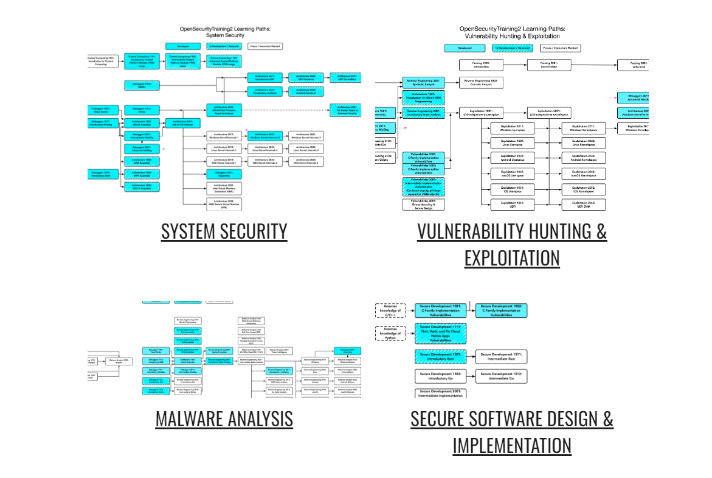
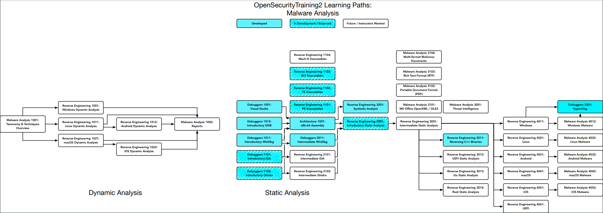

## O que é OpenSecurityTraining 2

A iniciativa chamada [OpenSecurityTraining 2](https://opensecuritytraining.info/Home.html) tem o princípio de abordar cursos de diversos ramos da Segurança, desde níveis mais baixos a mais altos. E é totalmente gratuito e aberto. A [gama de cursos](https://p.ost2.fyi/courses) é grande, ainda com planejamentos de cursos futuros dos instrutores de acordo com a "área" de especialização, como está demarcado nos [Learning Paths](https://opensecuritytraining.info/Learning%20Paths.html).

Atualmente estou na metade do curso de [Architecture 1001: x86-64 Assembly](https://p.ost2.fyi/courses/course-v1:OpenSecurityTraining2+Arch1001_x86-64_Asm+2021_v1/about) e fiquei impressionado com os desafios e mini games que o próprio funfador [Xeno Kovah](https://twitter.com/xenokovah) montou para o treinamento, fora as os vídeos bem explicados. 

Minha ideia é seguir com o "path" de Malware Analysis, que ainda faltam bastante cursos, mas isso não impede de alguém que queira se aprofundar de aprender os temas por outros meios.

Na H2HC de 2023, que aconteceu em São Paulo, tive a oportunidade de tirar uma foto com o criador da plataforma, o próprio Xeno

Me senti na obrigação de divulgar essa plataforma para as pessoas, principalmente para quem procura se especializar em algum tópico de baixo nível como é meu caso
